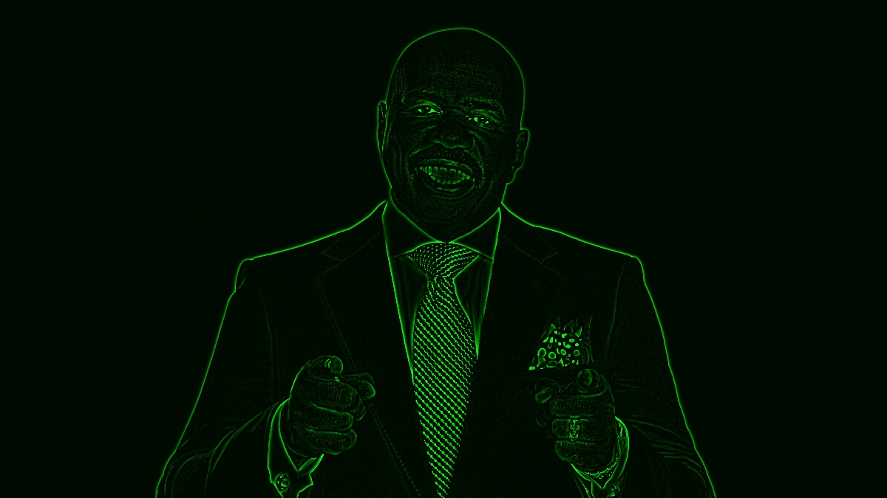

# Fake Night Vision

## Description
A Python-based tool using OpenCV to create a night vision effect on images. It allows real-time adjustments for Gaussian blur kernel size, contrast, brightness, and color channel through interactive trackbars.

## Features
- Real-time image processing with adjustable parameters
- Applies Gaussian blur to create a low-pass image and subtracts it to get a high-pass image
- Adjustable contrast and brightness on the high-pass image
- User-defined color channel for the night vision effect

## Before and After

### Original Image

### Processed Image

